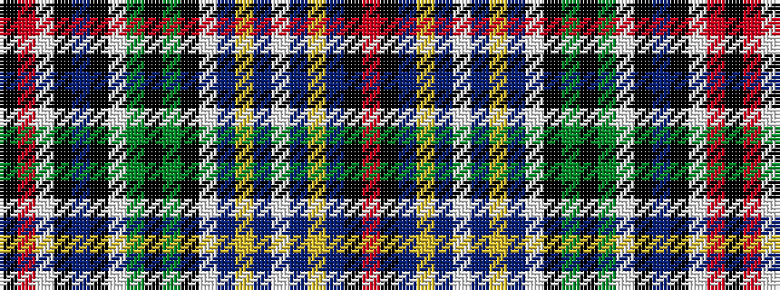

KRWKBKWGKGKWBYBWBYBKR

It is a 21 stripe tartan.

<figure class="pat-woven">

<figcaption>idealised sample</figcaption>
</figure>

## Colour Sequence



## Tartans with this colour sequence

| Tartans |
|---------------|
| [Murtaugh Hunting Tartan Tartan Number: 5818. Earliest known date: 2003 After original Murtaugh by Don Smith, Heraldic Graphics See products available Copyright © Blair Urquhart, Comrie, 2015](/setts/s21/r4k4n4ly2n2w2n2ly2n2w2k4g3k2g24w2k2n3k3w2r4k2~x2/)|
||
