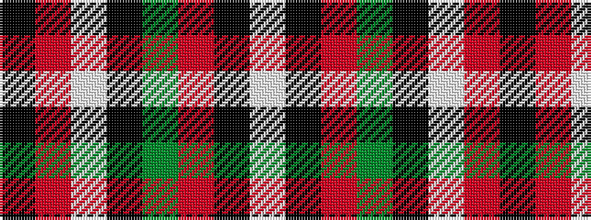

KRWKGRKW

It is a 8 stripe tartan.

<figure class="pat-woven">

<figcaption>idealised sample</figcaption>
</figure>

## Colour Sequence



## Tartans with this colour sequence

| Tartans |
|---------------|
| [Malliou, Despina (Personal)](/variants/s8/k8r7w4k8g5r7k18lt2~x2/)|
||
