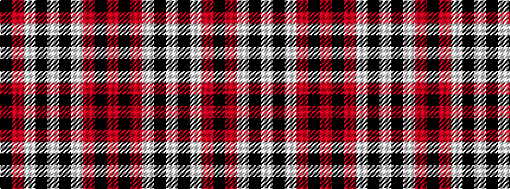

KRWKWKWRKR

It is a 10 stripe tartan.

<figure class="pat-woven">

<figcaption>idealised sample</figcaption>
</figure>

## Colour Sequence



## Tartans with this colour sequence

| Tartans |
|---------------|
| [Brice](/variants/s10/k9r18w2k2w4k2w2r12k9r6~x2/)|
||
