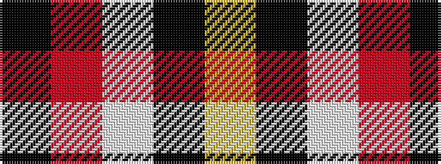

KRWKY

It is a 5 stripe tartan.

<figure class="pat-woven">

<figcaption>idealised sample</figcaption>
</figure>

## Colour Sequence



## Tartans with this colour sequence

| Tartans |
|---------------|
| [Perry / Pirrie (Personal)](/variants/s5/k75r26w2k4ly5~x2/)|
||
| [Perry Dress (Personal)](/variants/s5/k65r27w2k4ly5~x2/)|
||
