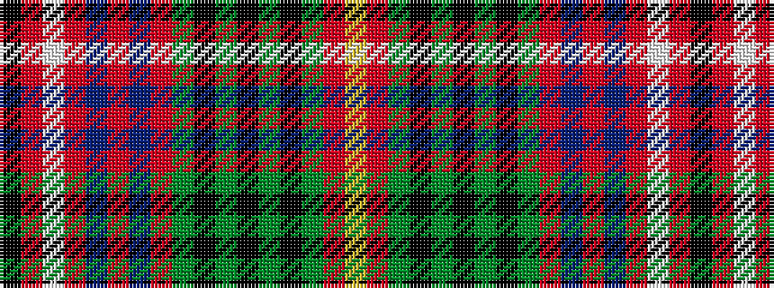

KRWRBRBRGKGKGKGRY

It is a 17 stripe tartan.

<figure class="pat-woven">

<figcaption>idealised sample</figcaption>
</figure>

## Colour Sequence



## Tartans with this colour sequence

| Tartans |
|---------------|
| [Wcwm 9275-1422-2](/setts/s17/k2r3lb2r3db2r3db2r14dy2k2dy2k2dy2k2dy2r20lr2~x2/)|
||
