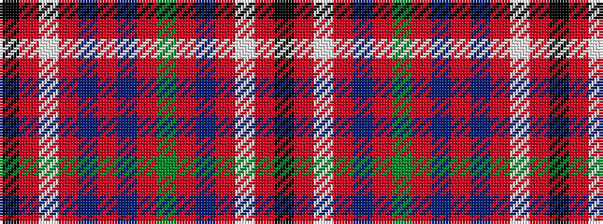

KRWRBRBRGRBRWRK

It is a 15 stripe tartan.

<figure class="pat-woven">

<figcaption>idealised sample</figcaption>
</figure>

## Colour Sequence



## Tartans with this colour sequence

| Tartans |
|---------------|
| [Fitzgerald Red](/setts/s15/k4r4w4r28b4r4g25r4b25r4b4r28w4r4k4~x2/)|
||
