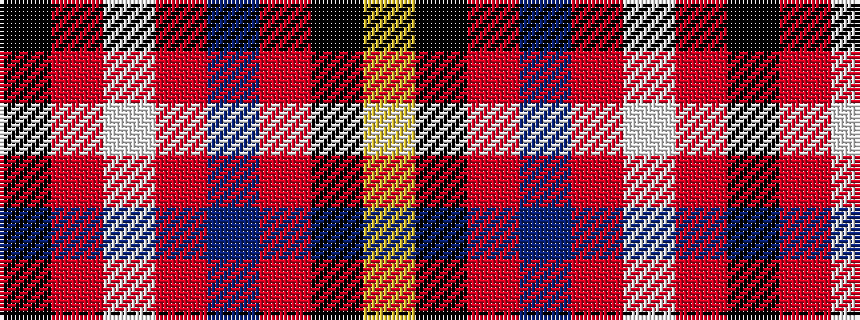

KRWRBRKY

It is a 8 stripe tartan.

<figure class="pat-woven">

<figcaption>idealised sample</figcaption>
</figure>

## Colour Sequence



## Tartans with this colour sequence

| Tartans |
|---------------|
| [Toronto Fire Services (Corporate)](/variants/s8/k4r2lb2r28db27r2k2lo2~x2/)|
||
