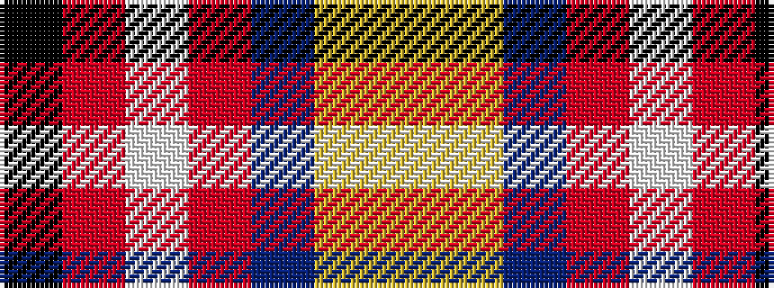

KRWRBYY

It is a 7 stripe tartan.

<figure class="pat-woven">

<figcaption>idealised sample</figcaption>
</figure>

## Colour Sequence



## Tartans with this colour sequence

| Tartans |
|---------------|
| [Barrington Municipality](/setts/s7/ly5lr3db6o8w5r17k2/)|
||
