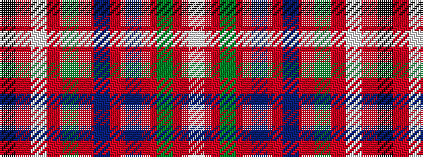

KRWRGRBRBRGRW

It is a 13 stripe tartan.

<figure class="pat-woven">

<figcaption>idealised sample</figcaption>
</figure>

## Colour Sequence



## Tartans with this colour sequence

| Tartans |
|---------------|
| [Bruce, William](/setts/s13/k3r8w1r8g5r4db8r4db8r4g5r17w3~x2/)|
||
