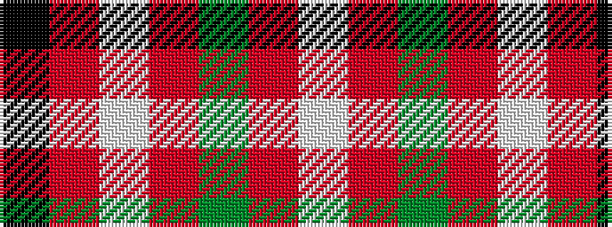

KRWRGRW

It is a 7 stripe tartan.

<figure class="pat-woven">

<figcaption>idealised sample</figcaption>
</figure>

## Colour Sequence



## Tartans with this colour sequence

| Tartans |
|---------------|
| [Starr (1978) (Name)](/setts/s7/k2r4w1r10g12r2w2~x4/)|
||
