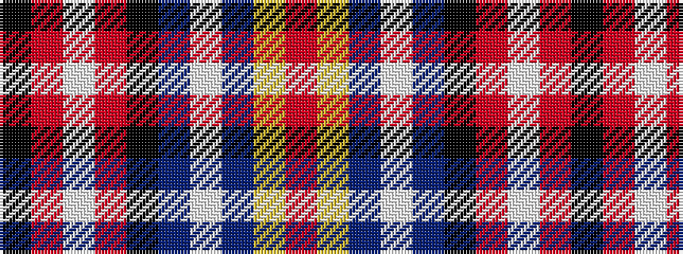

KRWRKBWBYR

It is a 10 stripe tartan.

<figure class="pat-woven">

<figcaption>idealised sample</figcaption>
</figure>

## Colour Sequence



## Tartans with this colour sequence

| Tartans |
|---------------|
| [RCACA](/variants/s10/k4r1w1r2k48dr4w1db30ly2r2~x2/)|
||
