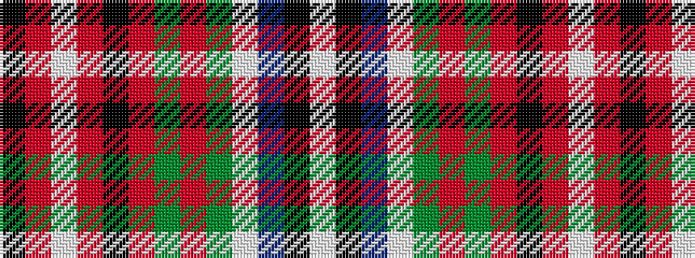

KRWRKRGRGWBKW

It is a 13 stripe tartan.

<figure class="pat-woven">

<figcaption>idealised sample</figcaption>
</figure>

## Colour Sequence



## Tartans with this colour sequence

| Tartans |
|---------------|
| [Peacock (Personal)](/setts/s13/w2k1b2lb1dg4r1dg4r3k3r12lb1r2k1~x4/)|
||
