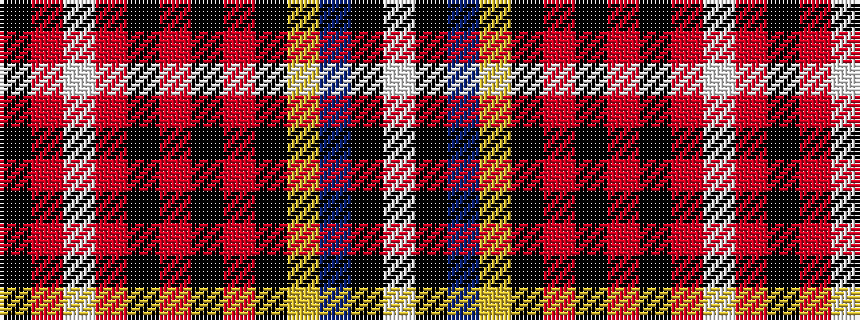

KRWRKRKRKYBKW

It is a 13 stripe tartan.

<figure class="pat-woven">

<figcaption>idealised sample</figcaption>
</figure>

## Colour Sequence



## Tartans with this colour sequence

| Tartans |
|---------------|
| [Wilding, Michael John (Personal)](/variants/s13/w2k2t2ly2k2r7k1r12k2r6w1r23k1~x2/)|
||
| [Wilding, Michael John (Personal)](/variants/s13/w2k2t2ly2k2r6k1r12k2r6w1r23k1~x2/)|
||
