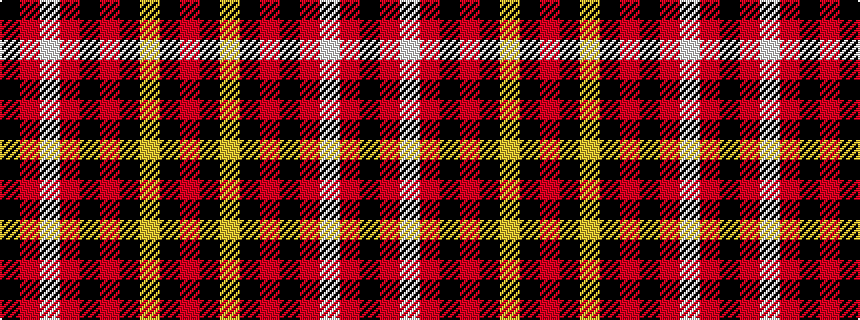

KRWRKRKYKR

It is a 10 stripe tartan.

<figure class="pat-woven">

<figcaption>idealised sample</figcaption>
</figure>

## Colour Sequence



## Tartans with this colour sequence

| Tartans |
|---------------|
| [Smeaton 1985 (Name)](/variants/s10/k6r4lb3r44k32r3k3lo3k2r3~x2/)|
||
