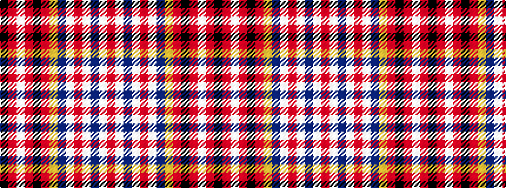

KRWRKRYBWRWBWR

It is a 14 stripe tartan.

<figure class="pat-woven">

<figcaption>idealised sample</figcaption>
</figure>

## Colour Sequence



## Tartans with this colour sequence

| Tartans |
|---------------|
| [El Dorado Hills Firefighters Pipes and Drums](/variants/s14/k5r1w2r1k26r3lo1dt10w1r3w1dt10w1r3~x2/)|
||
| [El Dorado Hills P & D (Corporate)](/variants/s14/k5r1w2r1k26r3lo1n10w1r3w1n10w1r3~x2/)|
||
