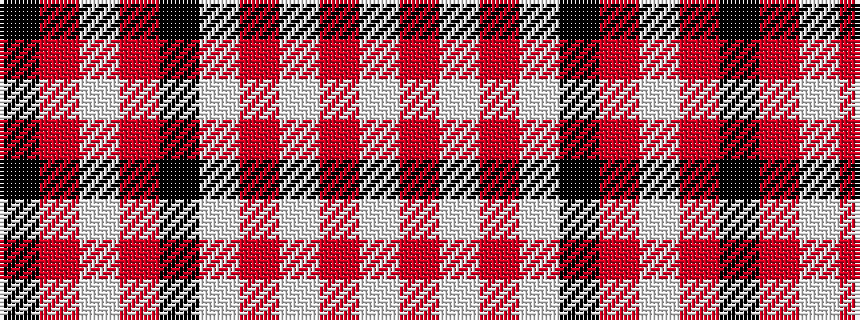

KRWRKWRWRW

It is a 10 stripe tartan.

<figure class="pat-woven">

<figcaption>idealised sample</figcaption>
</figure>

## Colour Sequence



## Tartans with this colour sequence

| Tartans |
|---------------|
| [Forbes (Fashion)](/setts/s10/k46r8lb1r8k8lb6o6lb14o1lb6~x4/)|
||
