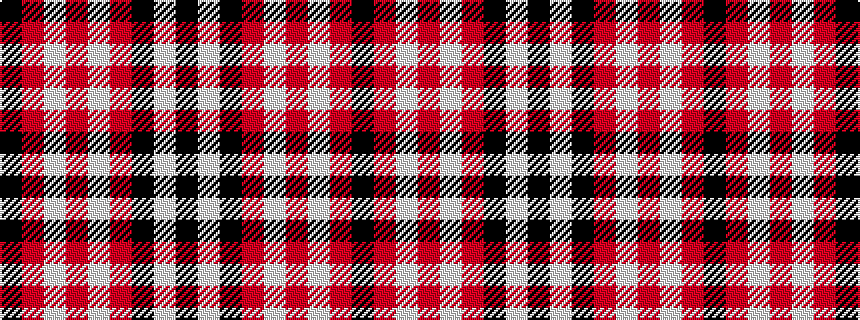

KRWRWRKWK

It is a 9 stripe tartan.

<figure class="pat-woven">

<figcaption>idealised sample</figcaption>
</figure>

## Colour Sequence



## Tartans with this colour sequence

| Tartans |
|---------------|
| [Tweedside Variation (silk sample)](/variants/s9/k50w3k3r4w3r3w5r3k3~x2/)|
||
