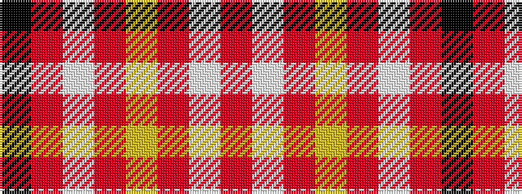

KRWRYRWR

It is a 8 stripe tartan.

<figure class="pat-woven">

<figcaption>idealised sample</figcaption>
</figure>

## Colour Sequence



## Tartans with this colour sequence

| Tartans |
|---------------|
| [Cornell (Corporate)](/variants/s8/r74w27r13lr7r13w13r74k7/)|
||
