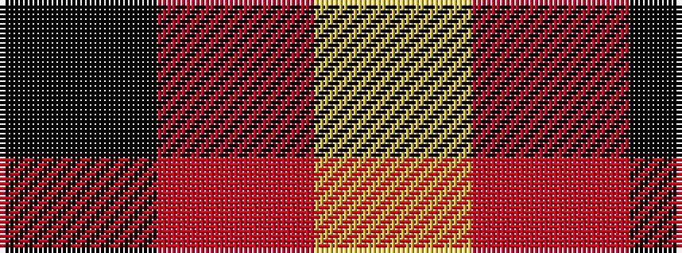

KRY

It is a 3 stripe tartan.

<figure class="pat-woven">

<figcaption>idealised sample</figcaption>
</figure>

## Colour Sequence



## Tartans with this colour sequence

| Tartans |
|---------------|
| [Batson (Personal)](/setts/s3/k69r14ly5~x2/)|
||
| [Quenouille (2011)](/setts/s3/ly49r16k11~x2/)|
||
