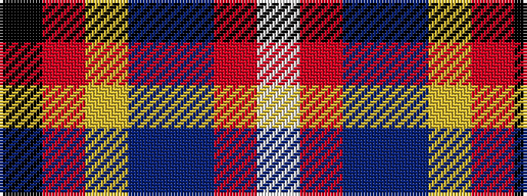

KRYBBRW

It is a 7 stripe tartan.

<figure class="pat-woven">

<figcaption>idealised sample</figcaption>
</figure>

## Colour Sequence



## Tartans with this colour sequence

| Tartans |
|---------------|
| [Hatcher (Texas) (Personal)](/variants/s7/lp33r7dt9b7lg12ri3k29~x2/)|
||
