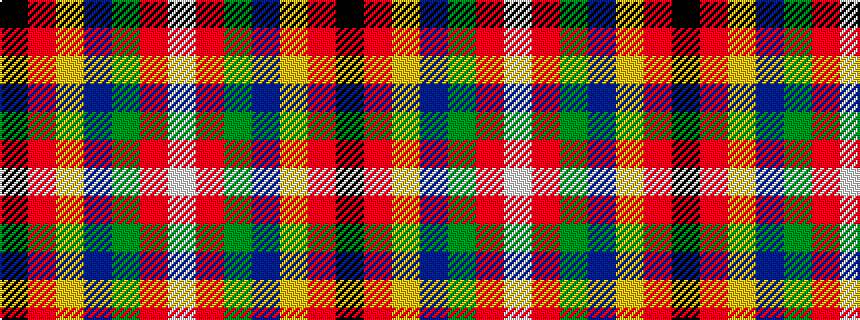

KRYBGRW

It is a 7 stripe tartan.

<figure class="pat-woven">

<figcaption>idealised sample</figcaption>
</figure>

## Colour Sequence



## Tartans with this colour sequence

| Tartans |
|---------------|
| [Eichelberger (Perrsonal)](/variants/s7/k20r6ly3db24g3r8w4~x2/)|
||
| [Eichelberger Family, Jörg (Personal)](/variants/s7/k10r3lo4dt12dg4r4w2~x4/)|
||
