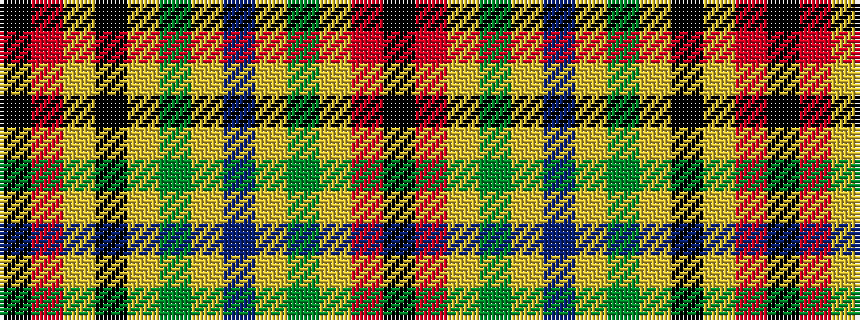

KRYGYBYGYKYRK

It is a 13 stripe tartan.

<figure class="pat-woven">

<figcaption>idealised sample</figcaption>
</figure>

## Colour Sequence



## Tartans with this colour sequence

| Tartans |
|---------------|
| [Neumann - German Pipe Smokers (Corp)](/variants/s13/k2r3ly1dy2ly1dt16ly1g32ly1k2ly1r1k1~x2/)|
||
