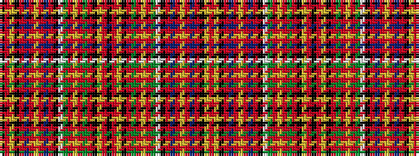

KRYKRBRYRBRKWGRYRGRKYRKRYKRGRYRGWKRBRYRBRKYR

It is a 44 stripe tartan.

<figure class="pat-woven">

<figcaption>idealised sample</figcaption>
</figure>

## Colour Sequence



## Tartans with this colour sequence

| Tartans |
|---------------|
| [Leith (Hay)](/setts/s44/k14r4ly4k8r70dp8r3ly3r8dp64r3k63w3g64r8ly3r3g8r70k8ly4r4k14/)|
||
