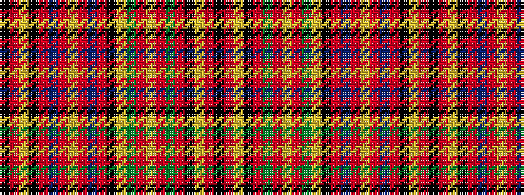

KRYKRBRYRBRKYGRYRGRKYRK

It is a 23 stripe tartan.

<figure class="pat-woven">

<figcaption>idealised sample</figcaption>
</figure>

## Colour Sequence



## Tartans with this colour sequence

| Tartans |
|---------------|
| [Hay and Leith](/setts/k3r1ly1k2r16dg2r1ly1r2dg15lr1k15r1n15r2ly1r1n2r16k2ly1r1k3/)|
||
