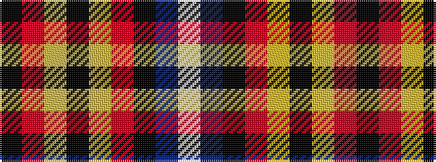

KRYKYRKBW

It is a 9 stripe tartan.

<figure class="pat-woven">

<figcaption>idealised sample</figcaption>
</figure>

## Colour Sequence



## Tartans with this colour sequence

| Tartans |
|---------------|
| [Muylle, Jelle (Personal)](/variants/s9/k5r1ly1k1ly1r1k8b1w1~x6/)|
||
