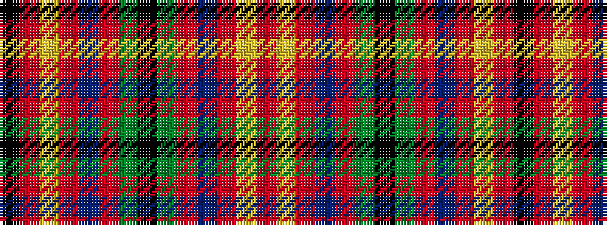

KRYRBRGKGRBRYR

It is a 14 stripe tartan.

<figure class="pat-woven">

<figcaption>idealised sample</figcaption>
</figure>

## Colour Sequence



## Tartans with this colour sequence

| Tartans |
|---------------|
| [Stewarton (Personal)](/variants/s14/o3lr3oi3db3oi3g3k1g3oi3db3oi3lr3o3k1~x4/)|
||
