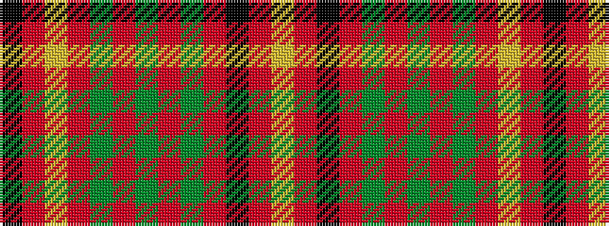

KRYRGRGRGRKRY

It is a 13 stripe tartan.

<figure class="pat-woven">

<figcaption>idealised sample</figcaption>
</figure>

## Colour Sequence



## Tartans with this colour sequence

| Tartans |
|---------------|
| [Bonnie Prince Charlie (Vyella)](/setts/s13/k5r7lo23r23dg3r11dg3r23dg18r2k18r5ly5/)|
||
