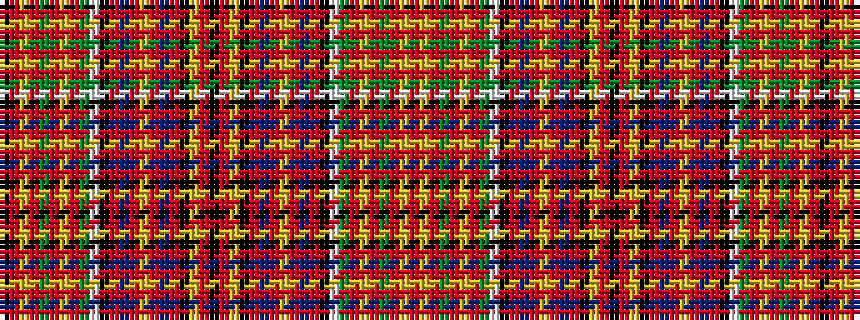

KRYRGRYRGWKRBRYRBRKYRKRYKRBRYRBRKWGRYRGRYR

It is a 42 stripe tartan.

<figure class="pat-woven">

<figcaption>idealised sample</figcaption>
</figure>

## Colour Sequence



## Tartans with this colour sequence

| Tartans |
|---------------|
| [Hay & Leith #2](/setts/s42/k7r3ly2r60g7r2ly2r7g50w2k50r2dt50r7ly2r2dt7r60k7ly2r3k7/)|
||
