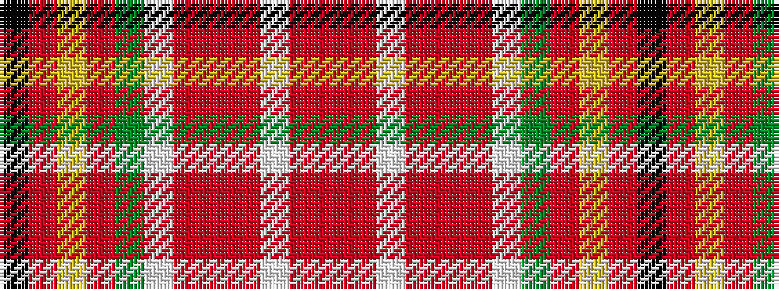

KRYRGWRRRWRR

It is a 12 stripe tartan.

<figure class="pat-woven">

<figcaption>idealised sample</figcaption>
</figure>

## Colour Sequence



## Tartans with this colour sequence

| Tartans |
|---------------|
| [Studio Wolf Polysun](/setts/s12/ri18r3w3r3ri2r1w1g1ri2ly1r1k1~x4/)|
||
