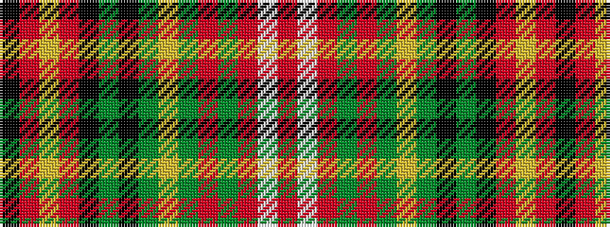

KRYRKGKGYGRGRWR

It is a 15 stripe tartan.

<figure class="pat-woven">

<figcaption>idealised sample</figcaption>
</figure>

## Colour Sequence



## Tartans with this colour sequence

| Tartans |
|---------------|
| [Scottish Register of Tartans (Corp)](/setts/s15/r11w4r8dy1r1dy28loi2dy28k2dy2k23r3lo6r3k5~x2/)|
||
