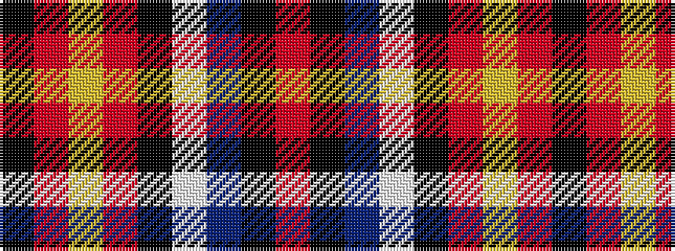

KRYRKWBKR

It is a 9 stripe tartan.

<figure class="pat-woven">

<figcaption>idealised sample</figcaption>
</figure>

## Colour Sequence



## Tartans with this colour sequence

| Tartans |
|---------------|
| [Tayside Police (Corporate)](/setts/s9/k12r12lo3r4k10w2dt17k13o4~x2/)|
||
