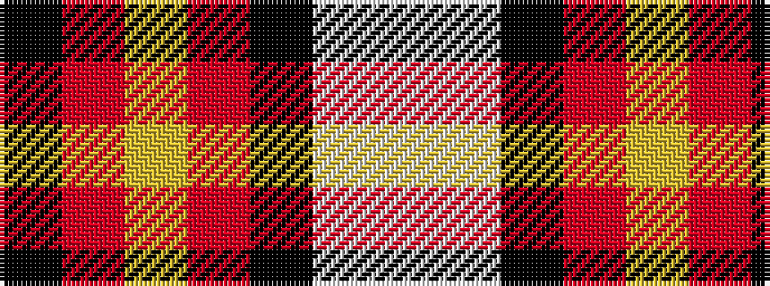

KRYRKWW

It is a 7 stripe tartan.

<figure class="pat-woven">

<figcaption>idealised sample</figcaption>
</figure>

## Colour Sequence



## Tartans with this colour sequence

| Tartans |
|---------------|
| [Oor Wullie Corporate Tartan](/variants/s7/k3r3lo2r20ki16lb24w2~x2/)|
||
