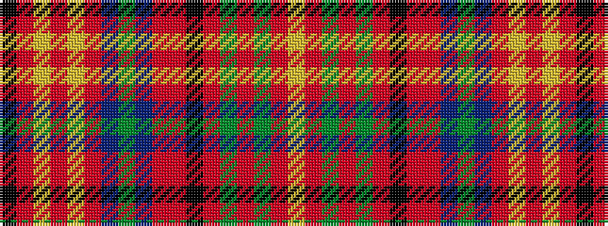

KRYRYRBGBRRKRGRGRY

It is a 18 stripe tartan.

<figure class="pat-woven">

<figcaption>idealised sample</figcaption>
</figure>

## Colour Sequence



## Tartans with this colour sequence

| Tartans |
|---------------|
| [Harmon (Name)](/setts/s18/k2r6lo2r2lo2r19dt2g2dt2r2ri4k2ri11g2ri2g2ri6lo2~x2/)|
||
| [Harmon (Personal)](/setts/s18/k2r6ly2r2ly2r19db2g2db2r2ri4k2ri11g2ri2g2ri6ly2~x2/)|
||
