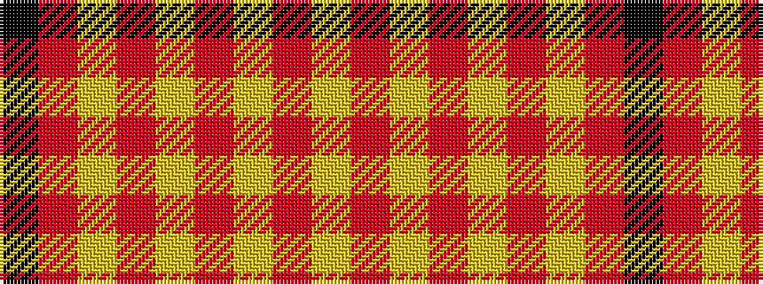

KRYRYRYRY

It is a 9 stripe tartan.

<figure class="pat-woven">

<figcaption>idealised sample</figcaption>
</figure>

## Colour Sequence



## Tartans with this colour sequence

| Tartans |
|---------------|
| [Fueglistal (Aargau) (Personal)](/variants/s9/k3o6lr13r2lr2r32lr1r2lr2~x2/)|
||
