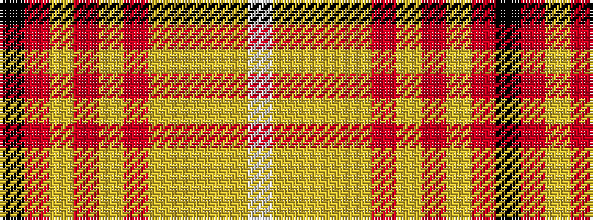

KRYRYRYYYYW

It is a 11 stripe tartan.

<figure class="pat-woven">

<figcaption>idealised sample</figcaption>
</figure>

## Colour Sequence



## Tartans with this colour sequence

| Tartans |
|---------------|
| [Shenzhen (Sports)](/variants/s11/k3o29lo2o2lo4o2lo20ly1lo2ly10w3~x2/)|
||
