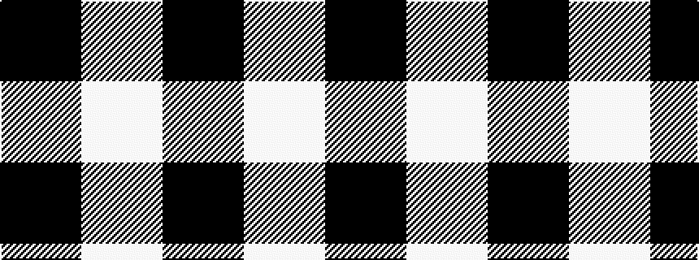

KW

It is a [2 stripe pattern](/stripes/stripes2/) — every 2-stripe pattern is gathered there.

<figure class="pat-woven">

<figcaption>idealised sample</figcaption>
</figure>

## Falkirk tartan

An ornamental twill check of natural light and dark wool, found at Falkirk in the neck of a jar of Roman coins buried about 260 AD — the oldest surviving Scottish tartan, now in the National Museum of Scotland. The black-and-white check is woven today as the Shepherd.

## Colour Sequence



## Tartans with this colour sequence

This pattern is a design lineage: every tartan below shares one colour order, whatever its owner —
near-identical designs are grouped, the largest lineage first (#112: the pattern is a tartan's
second parent, beside its family or clan).

<table class="sett-table">
<tbody>
<tr><td><a href="/tartans/j/jo/joy-s-fancy-allen/">Joy's Fancy, Allen</a></td></tr>
<tr><td class="sett-swatch"></td></tr>
<tr><td><a href="/tartans/s/sh/shepherd-or-falkirk/">Shepherd or Falkirk</a> <small class="dt">ΔTartan 0.79</small></td></tr>
<tr><td class="sett-swatch"></td></tr>
<tr><td><a href="/tartans/w/wi/wilson-s-no-172/">Wilson's No.172</a> <small class="dt">ΔTartan 0.79</small></td></tr>
<tr><td class="sett-swatch"></td></tr>
<tr class="cluster-sep"><td></td></tr>
<tr><td><a href="/tartans/s/sh/shepherd-3/">Shepherd</a> <small class="dt">ΔTartan 1.80</small></td></tr>
<tr><td class="sett-swatch"></td></tr>
</tbody>
</table>

