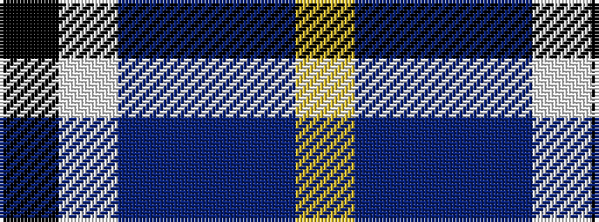

KWBBBY

It is a 6 stripe tartan.

<figure class="pat-woven">

<figcaption>idealised sample</figcaption>
</figure>

## Colour Sequence



## Tartans with this colour sequence

| Tartans |
|---------------|
| [Pipers' Trail Dance, The](/setts/s6/k6w49dt50dp6t8lo4/)|
||
| [Pipers' Trail Dance, The](/setts/s6/k6w49db50dp6db8ly4/)|
||
