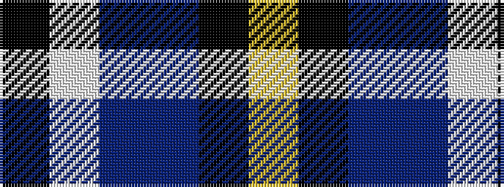

KWBBKY

It is a 6 stripe tartan.

<figure class="pat-woven">

<figcaption>idealised sample</figcaption>
</figure>

## Colour Sequence



## Tartans with this colour sequence

| Tartans |
|---------------|
| [Solberg-Bell](/variants/s6/ly8k2dt20t4w1k2~x4/)|
||
| [Solberg-Bell (Personal)](/variants/s6/lo8k2dt20t4w1k2~x4/)|
||
