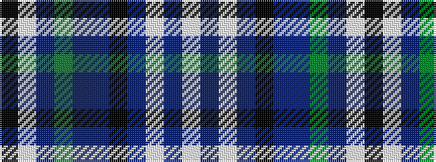

KWBGBBKBWBW

It is a 11 stripe tartan.

<figure class="pat-woven">

<figcaption>idealised sample</figcaption>
</figure>

## Colour Sequence



## Tartans with this colour sequence

| Tartans |
|---------------|
| [Lomond Mist](/setts/s11/k8lb1t1dy10t16p2k3n33lb1n3w2~x2/)|
||
