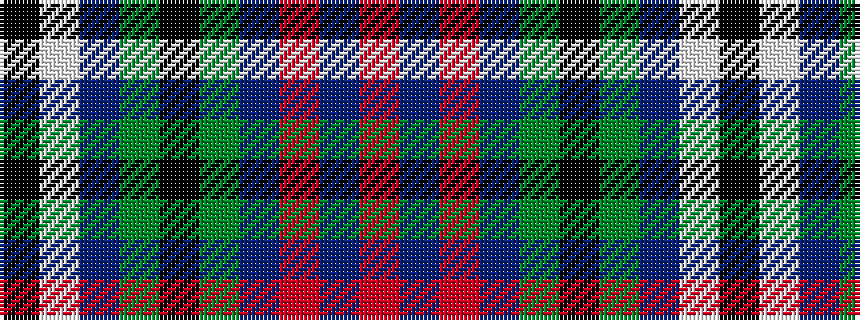

KWBGKGBRBR

It is a 10 stripe tartan.

<figure class="pat-woven">

<figcaption>idealised sample</figcaption>
</figure>

## Colour Sequence



## Tartans with this colour sequence

| Tartans |
|---------------|
| [Brotherston (Personal)](/setts/s10/k10lb5dp10g20k6g6db10r2db2r4~x2/)|
||
