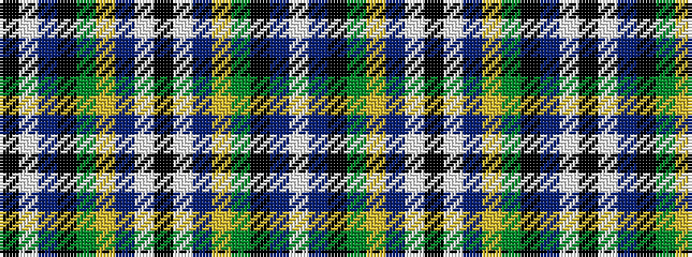

KWBKGYBWKWBYGKBW

It is a 16 stripe tartan.

<figure class="pat-woven">

<figcaption>idealised sample</figcaption>
</figure>

## Colour Sequence



## Tartans with this colour sequence

| Tartans |
|---------------|
| [Hancock Personal Tartan](/variants/s16/k11w4n12k2g3ly1n12w4k11~x2/)|
||
