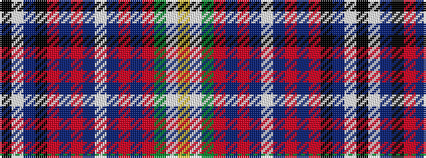

KWBKRBRBWBRBRGWY

It is a 16 stripe tartan.

<figure class="pat-woven">

<figcaption>idealised sample</figcaption>
</figure>

## Colour Sequence



## Tartans with this colour sequence

| Tartans |
|---------------|
| [MacLellan, Blue McLellan](/setts/s16/k2w1db7k4r1db4r2db4w2db4r2db4r1g7w1ly2~x2/)|
||
| [MacLellan/McLellan (Personal)](/setts/s16/k2w1db7k4r1db4r2db4w2db4r2db4r1dg7w1ly2~x4/)|
||
