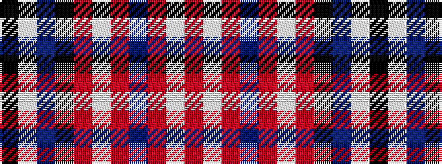

KWBKRWRBRWR

It is a 11 stripe tartan.

<figure class="pat-woven">

<figcaption>idealised sample</figcaption>
</figure>

## Colour Sequence



## Tartans with this colour sequence

| Tartans |
|---------------|
| [MacKellar Cerise Dress Tartan](/variants/s11/m20w3m3t4m3w3m5k10p3w35k3~x2/)|
||
