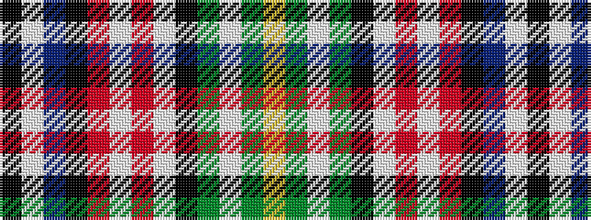

KWBKRWRWKGWGY

It is a 13 stripe tartan.

<figure class="pat-woven">

<figcaption>idealised sample</figcaption>
</figure>

## Colour Sequence



## Tartans with this colour sequence

| Tartans |
|---------------|
| [MacLellan/McLellan Dress (Personal)](/variants/s13/k2w1db7k4r1w8r2w8k1dg7w1dg7ly2~x4/)|
||
