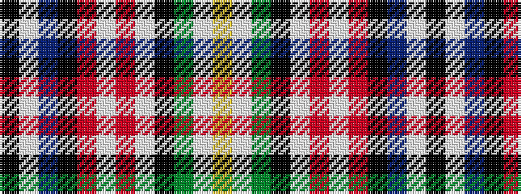

KWBKRWRWKGWY

It is a 12 stripe tartan.

<figure class="pat-woven">

<figcaption>idealised sample</figcaption>
</figure>

## Colour Sequence



## Tartans with this colour sequence

| Tartans |
|---------------|
| [MacLellan, dress McLellan](/setts/s12/k2w1db7k4r1w8r2w8k1g7w1ly2~x2/)|
||
