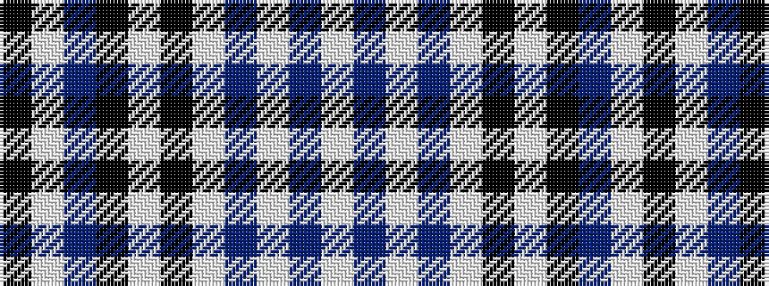

KWBKWKWBWBW

It is a 11 stripe tartan.

<figure class="pat-woven">

<figcaption>idealised sample</figcaption>
</figure>

## Colour Sequence



## Tartans with this colour sequence

| Tartans |
|---------------|
| [Clark](/variants/s11/k4w4db19k19w4k19w4db7w4db11w4~x2/)|
||
