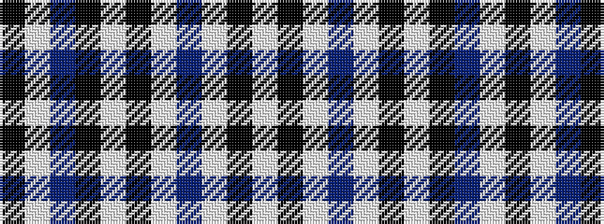

KWBKWKWBWKW

It is a 11 stripe tartan.

<figure class="pat-woven">

<figcaption>idealised sample</figcaption>
</figure>

## Colour Sequence



## Tartans with this colour sequence

| Tartans |
|---------------|
| [Clergy (Mackinlay)](/variants/s11/k1w1db8k9w1k9w1db2w1k4w1~x2/)|
||
