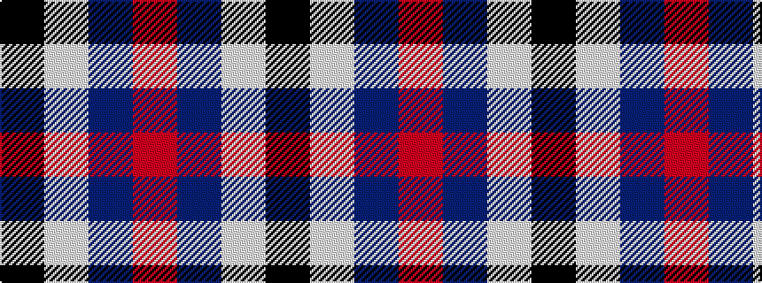

KWBR

It is a 4 stripe tartan.

<figure class="pat-woven">

<figcaption>idealised sample</figcaption>
</figure>

## Colour Sequence



## Tartans with this colour sequence

| Tartans |
|---------------|
| [MacRae - 2000 (Dress, Purple)](/variants/s4/k4w35dp35m4~x2/)|
||
| [MacRae Dress Purple](/variants/s4/k1w8db8r1~x8/)|
||
