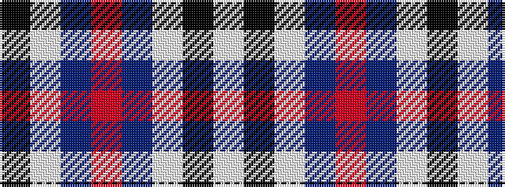

KWBRBWKW

It is a 8 stripe tartan.

<figure class="pat-woven">

<figcaption>idealised sample</figcaption>
</figure>

## Colour Sequence



## Tartans with this colour sequence

| Tartans |
|---------------|
| [Edinburgh Military Tattoo Dress](/setts/s8/k6w11b11r13db17w10k2w4~x2/)|
||
| [Edinburgh Tatttoo Dress (Corporate)](/setts/s8/k6w11t11r13db17w10k2w4~x2/)|
||
