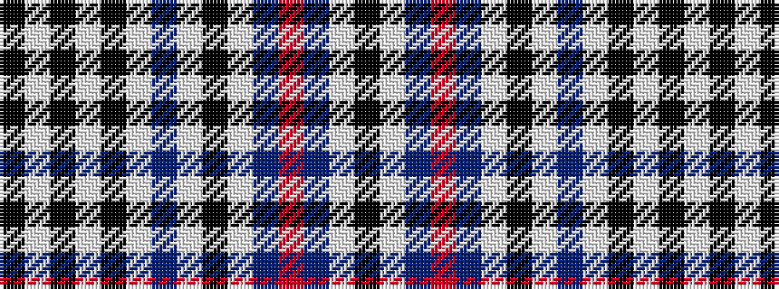

KWBRBWKWBWKWKWK

It is a 15 stripe tartan.

<figure class="pat-woven">

<figcaption>idealised sample</figcaption>
</figure>

## Colour Sequence



## Tartans with this colour sequence

| Tartans |
|---------------|
| [Beck (Personal)](/variants/s15/k4w2t15r6t25w2k4w2t15w4k2w4k2w4k2~x2/)|
||
